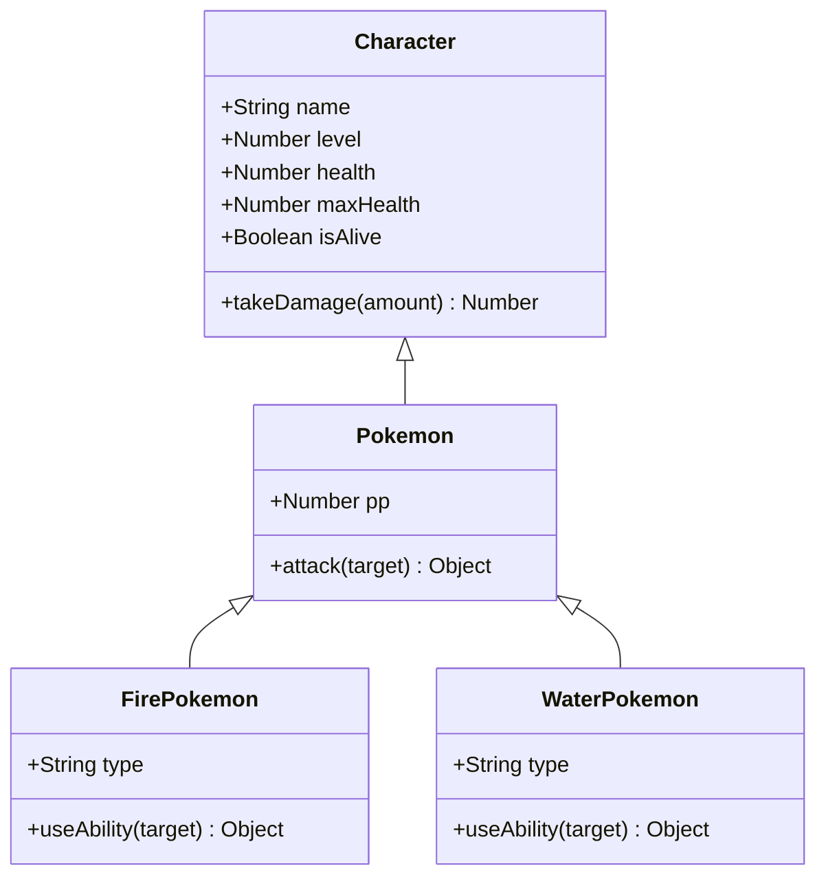

# Diagrama de Clases

```mermaid
classDiagram
    class Character {
        +String name
        +Number level
        +Number health
        +Number maxHealth
        +Boolean isAlive
        +takeDamage(amount) Number
    }

    class Pokemon {
        +Number pp
        +attack(target) Object
    }
    
    class FirePokemon {
        +String type
        +useAbility(target) Object
    }
    
    class WaterPokemon {
        +String type
        +useAbility(target) Object
    }

    Character <|-- Pokemon
    Pokemon <|-- FirePokemon
    Pokemon <|-- WaterPokemon
```
