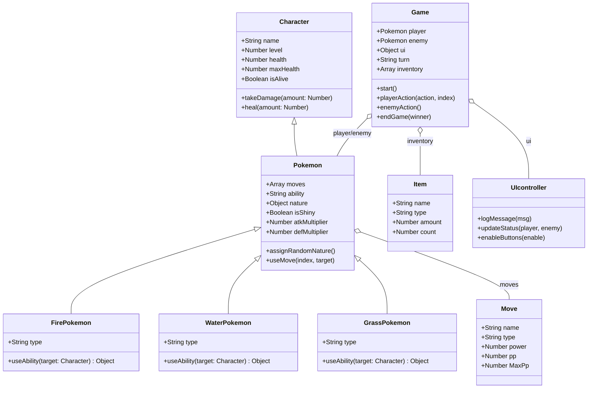

# Red vs Blue - Pokémon Battle Simulator

## Introducción

Este proyecto consiste en un simulador de combate Pokémon por turnos inspirado en el primer enfrentamiento icónico de las ediciones Rojo y Azul. El objetivo principal es aplicar los conceptos fundamentales de la Programación Orientada a Objetos (POO) en JavaScript, como la herencia, el polimorfismo y la modularización, para crear una experiencia de juego interactiva y visualmente atractiva que emule la estética de la Game Boy Advance.

La presente documentación detalla la arquitectura del software, la organización de los archivos, las jerarquías de clases y los estándares de desarrollo seguidos durante la creación del proyecto. Se profundiza en la lógica de combate, la gestión del estado del juego y la integración con la interfaz de usuario, proporcionando una guía completa para entender el funcionamiento interno del simulador.

### Tecnologías Utilizadas
*   **Lenguajes:** HTML, CSS, JavaScript.
*   **Fuentes:** Google Fonts.
*   **Sprites:** Pokémon Showdown Sprite Repository.
*   **Herramientas de Desarrollo:** VS Code, GitHub.

---

## Estructura de Archivos

El proyecto sigue una estructura modular diseñada para separar la lógica de negocio de la capa de presentación, facilitando el mantenimiento y la escalabilidad.

```text
redvsblue/
├── css/
│   └── style.css          # Estilos globales y diseño retro de la interfaz.
├── src/
│   ├── Character.js       # Clase base para todas las entidades con vida.
│   ├── Pokemon.js         # Clase intermedia con lógica específica de Pokémon.
│   ├── FirePokemon.js     # Subclase para Pokémon de tipo fuego.
│   ├── WaterPokemon.js    # Subclase para Pokémon de tipo agua.
│   ├── GrassPokemon.js    # Subclase para Pokémon de tipo planta.
│   ├── Game.js            # Motor lógico del sistema de combate.
│   ├── Item.js            # Definición de objetos de inventario.
│   ├── Move.js            # Definición de movimientos de combate.
│   ├── UIController.js    # Controlador de la interfaz gráfica.
│   └── main.js            # Punto de entrada y gestión del DOM.
├── index.html             # Estructura principal del documento.
├── README.md              # Documentación técnica del proyecto.
└── firered.png            # Asset visual para la pantalla de inicio.
```

### Justificación de la Estructura
*   **Modularización (src/):** Se emplea un sistema de módulos de ES6 para mantener cada clase en un entorno aislado, promoviendo el principio de responsabilidad única.
*   **Separación de Capas:** Se distingue claramente entre la capa de datos/lógica (clases en `src/`), la capa de presentación (HTML/CSS) y el controlador de la interfaz (`main.js`).
*   **Relación entre archivos:** El archivo `index.html` actúa como el contenedor donde convergen los estilos y la lógica. El script `main.js` se carga con el atributo `type="module"`, lo que le permite importar las dependencias necesarias de la carpeta `src/` y orquestar el inicio del juego. Los estilos en `css/` utilizan selectores específicos vinculados a los estados generados dinámicamente por las clases de JavaScript.

---

## Diagrama de Clases

La arquitectura del proyecto se basa en una jerarquía de herencia de tres niveles para maximizar la reutilización de código.



### Clases Principales
*   **Character (Clase Padre):** Define los atributos básicos de cualquier entidad que pueda recibir daño o ser curada. Es la raíz de la jerarquía.
*   **Pokemon (Clase Intermedia):** Extiende de `Character` y añade la lógica de combate Pokémon: movimientos, habilidades, naturalezas y el estado "Shiny". Implementa el método `useMove` que gestiona el daño según tipos.
*   **Game:** Actúa como el motor del juego. Gestiona el flujo de los turnos, procesa las acciones del jugador (atacar, usar objeto) y ejecuta la IA del oponente.
*   **UIController:** Gestiona la actualización de la interfaz gráfica, incluyendo los mensajes de log y las barras de salud.
*   **Main (Punto de Entrada):** Aunque no es una clase *per se* en este archivo, `main.js` funciona como la capa de control que instancia el `Game` y define el controlador de la interfaz para actualizar el DOM en tiempo real.

---

## Nomenclatura

Para asegurar la legibilidad y coherencia del código, se han adoptado las siguientes convenciones:

*   **PascalCase:** Utilizado exclusivamente para los nombres de las clases (ej. `Game`, `FirePokemon`). Los archivos que contienen estas clases también siguen esta convención.
*   **camelCase:** Utilizado para nombres de variables, funciones, métodos y constantes (ej. `playerAction`, `uiController`, `isAlive`).
*   **Upper Case / Screaming Snake Case:** Utilizado en el código para constantes globales si las hubiera, y en el CSS para ciertos selectores de estado.
*   **Buenas Prácticas:**
    *   **Identificadores Descriptivos:** Se evitan nombres genéricos como `x` o `data`.
    *   **DRY (Don't Repeat Yourself):** La lógica de daño se centraliza en `Pokemon.js` para que todas las subclases la compartan.
    *   **Comentarios de Código:** Se utilizan para explicar bloques lógicos complejos, aunque se prioriza el código autodocumentado.

---

## Repositorio

El flujo de trabajo en Git se basa en una adaptación de *GitFlow* para mantener la integridad del código.

### Estructura de Ramas
*   **main (production):** Contiene el código estable y listo para producción. No se trabaja directamente sobre ella.
*   **develop:** Rama principal de desarrollo donde se integran todas las nuevas funcionalidades antes de pasar a `main`.
*   **feature/Nombre-Funcionalidad:** Ramas temporales creadas para desarrollar una característica específica.
*   **hotfix/Nombre-Error:** Ramas urgentes para corregir errores críticos encontrados en producción.

### Buenas Prácticas de Git
*   **Commits:** Se utiliza el estándar de *Conventional Commits* 
*   **Frecuencia:** Commits pequeños y frecuentes que representen una unidad lógica de cambio.

---

## Licencia y Créditos

Este proyecto ha sido desarrollado con fines educativos para la asignatura de Programación.

**Autores del Proyecto y Documentación:**
*   **Pedro Jaime Gala** - Desarrollo integral, diseño de UI y arquitectura de clases.